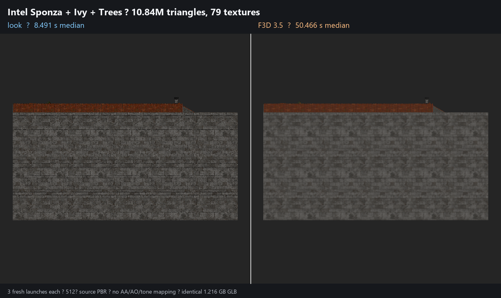
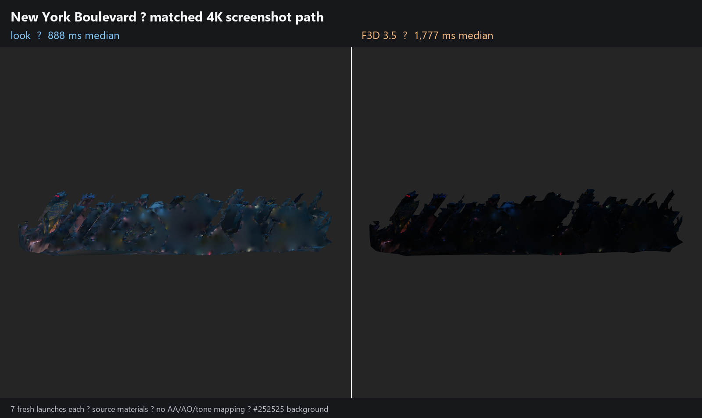

# look

`look` is a native command-line utility that turns GLB and STL models into PNG
images. Its basic purpose is to let a person, script, or software agent inspect
a 3D model without opening a full CAD application or browser-based viewer.



On the 10.8M-triangle Intel Sponza Base + Ivy + Trees scene, `look` completed a
fresh-process 512x512 PNG in **8.49 s** median versus **50.47 s** for F3D 3.5:
**5.94x faster** over three alternating launches. The same resident scene
rendered a 4K fly-through with 4x MSAA in **7.58 ms median GPU time**.
[Image license, raw samples, and exact configuration](docs/BENCHMARKS.md).



The 748K-triangle New York Boulevard demo completed at 4096x4096 in **888 ms**
median versus **1,777 ms** for F3D 3.5: **2.00x faster** over seven alternating
fresh launches.

## Quick example

Render an automatically framed isometric view:

```console
look model.glb --output render.png
```

That command loads `model.glb`, selects a technical material and lighting setup,
fits the camera to the model, renders an isometric view, and writes `render.png`.
No configuration file is required.

Render four camera views directly into one GPU-generated PNG:

```console
look model.glb --material-mode source \
  --views front,right,top,iso --camera orthographic \
  --resolution 384x384 --atlas 2 --output views.png --json
```

In the persistent 512 px-tile benchmark on an NVIDIA RTX 5050 Laptop GPU, this
four-view atlas took **8.94 ms** in `look`, versus **22.50 ms** in Three.js
WebGL2 and **27.30 ms** in Three.js WebGPU: `look` was **2.52x** and **3.05x**
faster, respectively. These figures measure render, readback, PNG encoding, and
output-file replacement after each renderer has initialized; see the
[benchmark methodology](docs/BENCHMARKS.md).

Compared with F3D, `look` has a deliberately narrower GLB/STL pipeline: it
avoids VTK's general-purpose data, scene, and application layers and compiles
the model directly into compact GPU buffers and material batches. That means
less startup work, scene traversal, allocation, and state conversion for the
specific render jobs `look` supports.

Compared with Three.js, `look` runs native Rust instead of a JavaScript object
graph inside Chromium, then reuses the GPU device, pipelines, textures, and
uploaded scene through persistent sessions. Its atlas path draws every view
into one render target in one GPU pass, followed by one readback and one PNG,
rather than paying per-view canvas and capture overhead.

`look` can also:

- render named camera views with controllable lighting and materials;
- combine several views into one atlas image for efficient agent inspection;
- report mesh, triangle, material, texture, and bounds metadata as JSON;
- execute repeatable YAML render jobs; and
- keep a scene GPU-resident for multiple inspection passes.

It uses Rust and `wgpu` directly and emits machine-readable results for agent
workflows. There is no browser, Electron shell, VTK scene layer, or import
framework on the hot path.

## Command help

Yes, every command has built-in help:

```console
look --help
look render --help
look persist --help
look --version
```

`look help render` is equivalent to `look render --help`.

## Install

Linux and macOS:

```sh
curl -fsSL https://raw.githubusercontent.com/stefangolas/look/main/install.sh | sh
```

Windows PowerShell:

```powershell
irm https://raw.githubusercontent.com/stefangolas/look/main/install.ps1 | iex
```

Release archives and Debian packages are also attached to each GitHub release.
See [installation](docs/INSTALLATION.md) for version pinning and source builds.

## Render

The `render` subcommand is implied when the first argument is a model path:

```console
look model.glb --view iso --resolution 1024x1024 --output render.png
look model.glb --material-mode source --antialias --output pbr.png
look bracket.stl --view front --camera orthographic --output bracket.png
look model.glb --views front,right,top,iso --output-dir renders --json
```

Pack multiple views into one GPU-rendered PNG atlas. The resolution is the size
of each tile, not the whole atlas:

```console
look model.glb --views front,right,top,iso --atlas 2 --output views.png --json
```

Use the F3D 3.5/VTK compatibility profile when comparing the two renderers:

```console
look model.glb --preset f3d-match --view front --camera orthographic --output matched.png
```

The profile matches F3D's default camera framing, background, and five-light
kit. It is a compatibility preset, not a promise of pixel identity for every
PBR material.

## Reuse a loaded scene

Repeated inspection should avoid parsing, texture decoding, shader creation,
and GPU upload. `persist` starts a private loopback server, warms the scene, and
returns a session ID:

```console
look persist assembly.glb --material-mode source --ttl 600 --json
look render --session SESSION_ID --views front,right,top,iso --atlas 2 --output views.png --json
look inspect --session SESSION_ID --json
look close SESSION_ID --json
```

Use `look sessions --json`, `look server status --json`, and
`look server stop --json` to manage the local server. Sessions expire after the
configured idle lifetime. The server binds only to loopback and authenticates
requests with a per-process token stored in the user's cache directory.

## YAML jobs

```console
look run examples/technical.yaml --json
```

```yaml
version: 1
scene:
  source: assembly.glb
  up_axis: y
render:
  resolution: [1024, 1024]
  material_mode: technical
  background: "#252525"
  antialias: false
  atlas_columns: 2
lighting:
  preset: technical
  ambient: 0.35
  direction: [-1, -2, -3]
  intensity: 0.85
  color: "#ffffff"
views:
  - id: front
    type: orthographic
    direction: [0, 0, 1]
  - id: iso
    type: perspective
    direction: [1, 1, 1]
output:
  directory: renders
  naming: "{view}.png"
```

Unknown YAML fields are rejected instead of silently ignored.

## Included test model

The repository includes `tests/fixtures/triangle.stl`, a 162-byte ASCII STL
used for CLI, package, parser, and render smoke tests:

```console
look tests/fixtures/triangle.stl --output triangle.png --json
```

The native GPU test also constructs a minimal embedded-buffer GLB at runtime,
so the generated binary fixture cannot drift independently from the test that
validates it. Larger Khronos models such as Damaged Helmet are benchmark inputs,
not repository fixtures; they are kept under the ignored `target/bench/models`
directory to avoid bloating normal clones and redistributing third-party assets
without their model-specific license records.

## Current scope

- Embedded-buffer GLB/glTF 2.0 and binary or ASCII STL
- Technical material mode and glTF metallic-roughness source materials
- Base-color, metallic-roughness, normal, emissive, and occlusion textures
- Alpha modes, UV0/UV1, vertex colors, instancing, and geometry deduplication
- Perspective and orthographic bounds-fit cameras with seven named views
- Configurable technical lighting and an F3D 3.5 compatibility light kit
- Multi-view PNGs and single-pass GPU atlas rendering
- Content-validated scene metadata cache and bounded GPU-resident session cache
- DirectX 12, Vulkan, Metal, and browser WebGPU-class portability through `wgpu`

This is deliberately a renderer, not an embeddable CAD framework or general
scene editor.

## Measured performance

Local measurements used an NVIDIA RTX 5050 Laptop GPU, 512 px tiles, source PBR
materials, and 11 resident samples. Lower is better.

| Resident workload | look | Three.js WebGL2 | Three.js WebGPU |
|---|---:|---:|---:|
| One view, render + PNG | 3.46 ms | 7.60 ms | 13.50 ms |
| Four-view 2x2 atlas, render + PNG | 8.94 ms | 22.50 ms | 27.30 ms |

The `look` measurements include replacing the output file; the browser numbers
stop after PNG encoding. Chrome WebGL2 and `look` reported the RTX adapter.
Chrome withheld WebGPU adapter identity, so that row is informative rather than
a same-adapter performance claim.

Against clean-config F3D 3.5 fresh processes on six glTF sample models, `look`
was 1.11x to 1.57x faster with a 1.40x geometric-mean speedup. It was 2.00x
faster on New York Boulevard at 4K, 6.43x faster on the 3.75M-triangle Intel
Sponza base scene, and 5.94x faster on the 10.8M-triangle Sponza foliage
composite at 512px. These are local results, not universal guarantees. Full
commands, raw samples, fidelity metrics, and methodological limits are in
[benchmarks](docs/BENCHMARKS.md).

## Development

```console
cargo fmt --all -- --check
cargo check --locked --all-targets
cargo test --locked --all-targets
cargo test --release --test gpu_smoke -- --ignored --nocapture --test-threads=1
```

See [architecture](docs/ARCHITECTURE.md), [cross-platform testing](docs/CROSS_PLATFORM_TESTING.md),
and [AGENTS.md](AGENTS.md). GitHub Actions builds and smoke-tests release
binaries for Linux, Windows, and macOS on x64 and ARM64.

Licensed under MIT or Apache-2.0.
