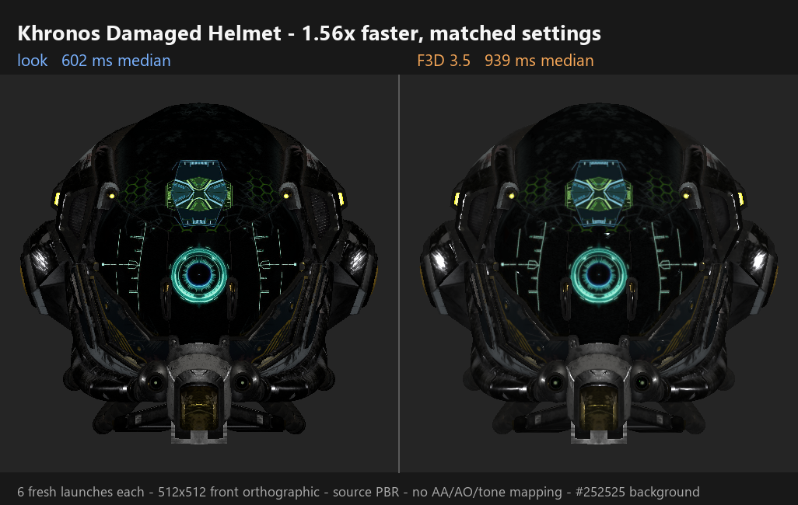

# Benchmarks

Benchmark claims are separated by lifecycle. F3D is measured as a fresh
executable because that is its normal screenshot path. Three.js and `look`
sessions are measured after model parsing, shader creation, and GPU upload
because they represent repeated inspection.

These measurements were collected on one Windows laptop with an NVIDIA GeForce
RTX 5050 Laptop GPU. They establish local wins and identify bottlenecks; they do
not predict every machine.

## Fresh process: look and F3D 3.5

`benchmarks/compare-pbr.ps1` launches a new process for every sample. It performs
one unmeasured conditioning launch per tool, alternates launch order, disables
F3D user configuration, and measures process start through a completed PNG.

Shared settings:

- 512x512 output
- front orthographic automatic fit
- glTF source PBR materials
- antialiasing, ambient occlusion, and tone mapping disabled
- `#252525` background
- seven measured launches per model
- `look --preset f3d-match`



Both panels above come from the runs tabulated here. Shading differs slightly
because F3D/VTK and `wgpu` do not share a material, sampling, and color
pipeline; the pixel-space error for this model is tabulated further down.

| Khronos glTF sample | look median | F3D median | F3D / look |
|---|---:|---:|---:|
| Box | 531.751 ms | 588.282 ms | 1.106x |
| Damaged Helmet | 602.276 ms | 939.075 ms | 1.559x |
| Avocado | 538.785 ms | 846.856 ms | 1.572x |
| BoomBox | 564.027 ms | 876.118 ms | 1.553x |
| Metal-Rough Spheres | 560.613 ms | 716.991 ms | 1.279x |
| Normal/Tangent Test | 567.921 ms | 795.104 ms | 1.400x |

The geometric-mean speedup is 1.40x. The cold path is dominated by operating
system process launch and GPU adapter/device initialization. Actual GPU draw
time is a small fraction, so low-level shader improvements cannot remove most
of this latency.

The raw report is generated at `target/bench/pbr/benchmark.json`. Model SHA-256
prefixes for this run were `ed52f719` (Box), `a1e3b04d` (Helmet), `ccc9c3ce`
(Avocado), `f8b91844` (BoomBox), `450c0555` (Spheres), and `5ac09323`
(Normal/Tangent).

Run it with:

```powershell
cargo build --release
./benchmarks/compare-pbr.ps1
```

### Larger scenes

The same fresh-process harness was also run against two environment models.
These are separate workloads and are not folded into the six-model Khronos
geometric mean.

New York Boulevard contains 747,897 triangles, 650,951 compiled vertices, 11
draw instances, and two source textures. At 4096x4096, seven measured launches
produced:

| Renderer | Samples (ms) | Median |
|---|---|---:|
| look | 697.395, 887.887, 1029.659, 709.606, 1138.825, 684.565, 1146.297 | 887.887 ms |
| F3D 3.5 | 2321.472, 1769.127, 2391.241, 1770.464, 1765.476, 1785.720, 1776.994 | 1776.994 ms |

F3D / look was 2.001x. Foreground bounds were identical at
`[213, 1655, 3878, 2438]`. The asset declares `KHR_materials_unlit`; `look`
honors that extension while the F3D-compatible lighting path produces visibly
different shading, so this is a matched framing and output-work comparison,
not a claim of pixel identity. Linear-RGB RMSE over the foreground union was
0.0311 and alpha was identical.

Intel's Sponza Base Scene contains 3,747,018 triangles, 1,945,350 compiled
vertices, 405 draw instances, 29 materials, and 72 textures. The official
textures are 4096x4096. The comparison used a geometry-identical derivative
with each texture resized to 2048x2048 so both renderers fit reliably on this
laptop:

| Renderer | Samples (ms) | Median |
|---|---|---:|
| look | 2832.891, 3262.294, 2770.226 | 2832.891 ms |
| F3D 3.5 | 18220.546, 18233.087, 16625.062 | 18220.546 ms |

F3D / look was 6.432x at 512x512. This is mainly a scene import, texture, and
renderer initialization result: `look`'s measured GPU draw was about 1.1 ms.
The full 4K-texture package did not complete reliably in source-material mode
on this GPU, while technical mode succeeded because it intentionally skips
source texture decode and upload. The reduced derivative SHA-256 is
`b283303b7133df7ab6939229ac6492dcee3ee84ab9722041b2af5cf6bad79564`.

The New York asset hash reported by `look` was
`2238e481971910f248d66ea6796191d1dc4cb5f819940680b58760c270dd5235`.
The Sponza derivative source hash was
`e3e8fb573e1718cd5ea51b5ce948b040ca13fdcbcf735a6acb8dd20d1b7cb3f8`.

#### Foliage stress scene

The official Sponza Base, Ivy, and Trees packages were merged into one GLB by
`benchmarks/merge-gltf-scenes.py`. The composite contains 10,836,323 triangles,
6,928,589 compiled vertices, 411 draw instances, 348 geometries, 34 materials,
and 79 textures. Base textures were resized to 2048x2048; the foliage add-on
textures remain at their official resolution.

At 512x512, after one conditioning launch and with alternating launch order:

| Renderer | Samples (ms) | Median |
|---|---|---:|
| look | 36244.279, 8491.023, 7533.588 | 8491.023 ms |
| F3D 3.5 | 52770.050, 46137.207, 50466.004 | 50466.004 ms |

F3D / look was 5.943x. The first `look` sample was a large outlier and is
retained above. Foreground bounds matched at `[26, 130, 486, 382]`;
linear-RGB RMSE over the foreground union was 0.0166 and alpha was identical.
The combined source hash reported by `look` was
`1c4c0098e9dbf5b21955a81d21b0e0bf1bfd4df9e0801c908b2a4183045c47f5`.

This scene also exposed and fixed a real scale limit: `look` had requested
wgpu's portable 256 MiB maximum buffer size even when the physical adapter
supported larger buffers. It now requests the adapter's native buffer-size
limit and reports an ordinary error if a packed scene buffer still exceeds it,
instead of allowing a GPU validation panic.

## F3D visual compatibility

The F3D match profile is pinned to F3D 3.5's VTK camera framing and default
five-light `vtkLightKit`, including its camera-relative key, fill, head, and two
back lights. With clean F3D configuration, the measured object bounding-box
difference was 0.00% to 0.45% across all six fixtures. Alpha matched for these
opaque models.

Linear-RGB RMSE after common framing was:

| Model | RMSE |
|---|---:|
| Box | 0.0099 |
| Damaged Helmet | 0.0430 |
| Avocado | 0.0063 |
| BoomBox | 0.0271 |
| Metal-Rough Spheres | 0.0289 |
| Normal/Tangent Test | 0.0239 |

Box and Avocado are near a 1% pixel-space error. The textured and strongly PBR
fixtures differ more because F3D/VTK and `wgpu` do not use identical material,
sampling, and color pipelines. Use a perceptual metric and an explicit
tolerance for regression testing; do not require byte-identical PNGs.

## Resident scene: look and Three.js

`examples/session_benchmark.rs` loads Damaged Helmet once, decodes textures,
creates the device and pipelines, uploads the model, and performs a 1x1 warm
render. Eleven measured iterations then include render submission, readback,
PNG encoding, and output-file replacement.

The Three.js harness uses Three.js 0.185.1, persistent headless Chrome 150,
the same model, cameras, bounds fit, background, source PBR materials, no AA,
an explicit GPU finish, and canvas PNG encoding. Browser launch is excluded.
The browser results do not include writing the encoded PNG to disk, making the
comparison conservative for `look`.

| Workload | look | Three.js WebGL2 | Three.js WebGPU | look vs WebGL2 | look vs WebGPU |
|---|---:|---:|---:|---:|---:|
| One 512x512 view | 3.459 ms | 7.600 ms | 13.500 ms | 2.20x | 3.90x |
| Four-view 2x2 atlas | 8.940 ms | 22.500 ms | 27.300 ms | 2.52x | 3.05x |

`look` setup was 717.687 ms. Its last atlas sample spent 0.213 ms submitting GPU
work and 1.915 ms reading back; PNG encoding and file output dominate the
resident path. This is the current Amdahl limit and the best optimization target
for repeated screenshots.

Chrome WebGL2 reported ANGLE on the same RTX 5050. Chrome's WebGPU adapter-info
object was empty because of browser privacy controls. The harness requested
WebGPU, verified that Three.js resolved WebGPU rather than falling back, and
launched Chrome with its high-performance-GPU preference, but the WebGPU result
must not be described as a proven same-adapter comparison.

Run the native resident benchmark:

```console
cargo run --release --example session_benchmark -- target/bench/models/DamagedHelmet.glb 11
```

Run the browser harness:

```console
cd benchmarks/threejs
npm install
npm run bench:webgl -- ../../target/bench/models/DamagedHelmet.glb 11 webgl2
npm run bench:webgpu
```

Reports are written beneath `target/bench/threejs`.

## Resident camera path

`examples/camera_path_benchmark.rs` moves a perspective camera through the
interior of a resident scene, reads every frame back, and writes four sampled
keyframes as an atlas. Set `LOOK_GPU_TIMESTAMPS=1` to separate GPU execution
from submission and readback:

```console
LOOK_GPU_TIMESTAMPS=1 cargo run --release --example camera_path_benchmark -- \
  target/bench/models/Sponza-2k.glb 120 1024x1024
```

On base Sponza, the retained 120-frame 1024x1024 path measured 1.587 ms median
GPU time (1.724 ms p95) and 4.999 ms median wall time including readback. The
retained 30-frame 4096x4096 path with `--antialias` measured 4.661 ms median GPU
time (6.337 ms p95) and 26.767 ms median wall time.

Adding Ivy and Trees made the same 30-frame 4K, 4x-MSAA workload materially more
demanding: 7.580 ms median GPU time, 10.039 ms p95, and 37.330 ms median wall
time. A resident four-view 512px atlas measured 12.232 ms median GPU time.
Three.js WebGL2 measured 9.9 ms for its GPU-finish interval on the same atlas
and confirmed ANGLE D3D11 on the same RTX 5050; `look` therefore does not claim
a pure-GPU win for that workload. End-to-end atlas medians were 38.05 ms for
`look` and 42.5 ms for Three.js. Three.js WebGPU measured 17.0 ms, but Chrome
withheld adapter identity, so it is not a proven same-adapter comparison.

Atlas scaling provides a separate saturation lane. With 512px tiles and 4x
MSAA, median GPU time was 9.525 ms for 8 views, 19.108 ms for 16, 38.850 ms for
32, and 80.837 ms for 64. The 64-view pass submits 25,920 draws and transforms
about 239.8 million triangles.

## Rules for publishable results

- Record the `look` commit, model hash, OS, GPU, driver, backend, and power mode.
- Benchmark a release build and retain all raw samples, not only the median.
- Alternate competitors when shared machine state can bias launch order.
- Do not run other GPU-heavy workloads during a performance measurement.
- Hosted, virtual, partitioned, or software GPUs are correctness lanes only.
- Publish timing claims only from a physical machine with a recorded adapter.
- Compare outputs as well as speed. A faster render with materially different
  framing, alpha, or color is not a valid win.
